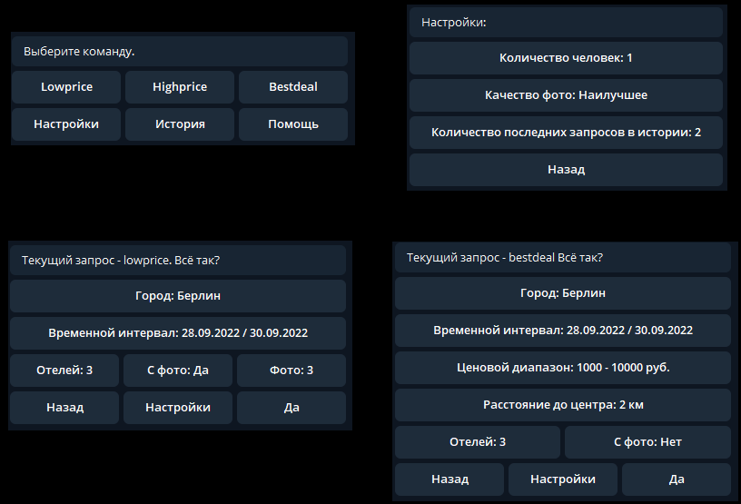
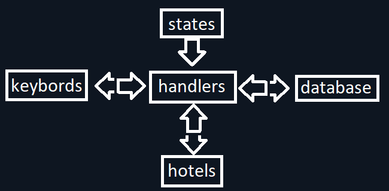

##  Телеграмм-бот поиска отелей на Hotel.com

Бот разработан в рамках дипломного проекта Skillbox. 
Имеются следующие основные команды:
- Lowprice - Узнать топ самых дешёвых отелей в городе
- Highprice - Узнать топ самых дорогих отелей в городе
- Bestdeal - Узнать топ отелей, наиболее подходящих по цене и расположению от центра
- Настройки имеют количество заселяемых человек, качество фото и величина истории
- История запросов
- Помощь
             
Перед запросом имеется возможность увидеть все параметры и их изменить.
Результат запроса будет сохранён в историю. 

Структура меню

> Если нажать старт при любом вводе - все текущие настройки будут обнулены.
> Поиск городов для России не работает.

Структура проекта
